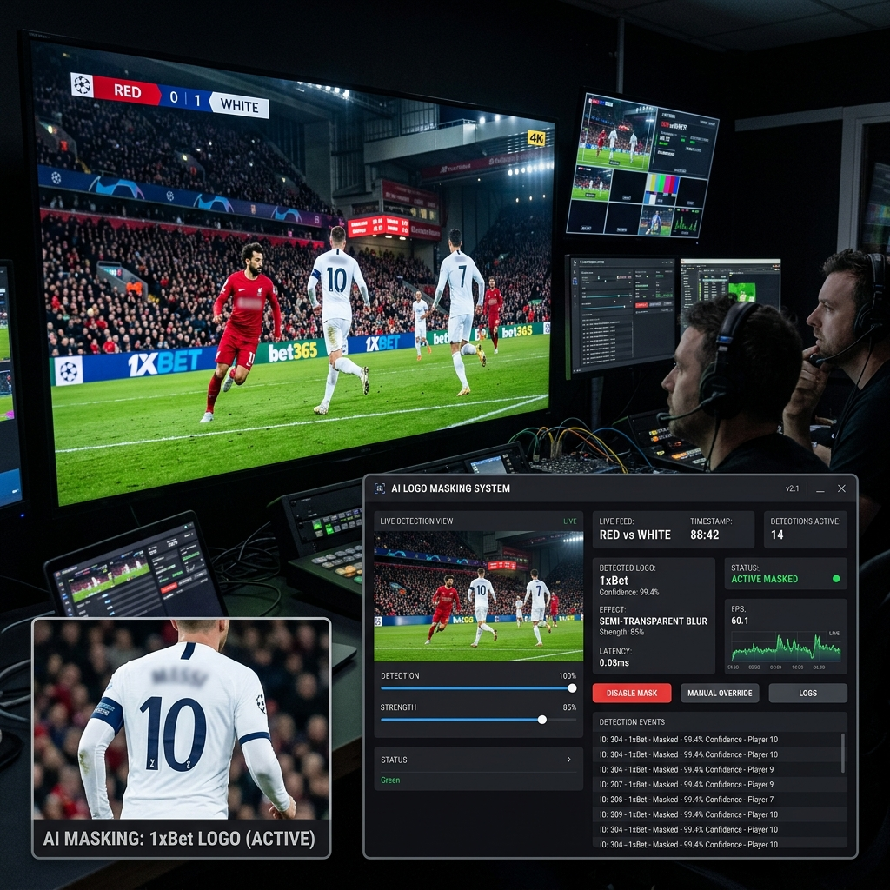
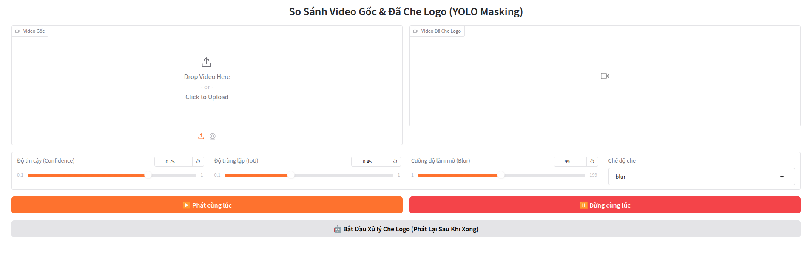

# Smart Logo Masker 🛡️






This project uses YOLOv26 Segmentation to automatically detect and mask betting logos (e.g., 1xbet, melbet, etc.) in videos.

## 1. Setup Data

The data preparation process involves converting labels from LabelMe format (JSON) to YOLO format.

### Input Directory Structure:
Place raw data in the `data_raw/Round_01/` directory. Each subdirectory should represent a class or contain the class name in the subdirectory's name.
```text
data_raw/Round_01/
├── 1xbet/
│   ├── img1.jpg
│   ├── img1.json
├── admiralbet/
│   ├── img2.jpg
│   ├── img2.json
```

### Run Preparation Script:
Use the `prepare_data.py` script to automatically split train/val sets and create the `data.yaml` file.
```bash
python3 prepare_data.py
```
Pre-processed data will be located in the `dataset/` directory.

---

## 2. Training (Training)

To start training, run the `train_yolo.py` file. This script is pre-configured with optimal parameters for segmentation.

```bash
python3 train_yolo.py
```

### Key Parameters in `train_yolo.py`:
- `model`: Base model (default is `yolo26x-seg.pt`).
- `epochs`: Training epochs (default 300).
- `imgsz`: Input image size (640).
- `batch`: Batch size (reduce if you run out of RAM/VRAM).
- `patience`: Automatically stops training if the model doesn't improve after $N$ epochs (default 50).

---

## 3. Inference (Inference)

Once training is complete, you can use the `predict.py` file to run on new data.

```bash
python3 predict.py --source path/to/images --weights runs/segment/logo_masker_model/weights/best.pt --conf 0.75
```

---

## 4. Parameter Tuning (Parameter Tuning)

| Parameter | Meaning | Advice |
| :--- | :--- | :--- |
| `conf` | Confidence Threshold | Increase (0.8+) if you see many false masks. Decrease if the model misses logos. |
| `iou` | NMS Threshold | Adjust if there are multiple overlapping masks for the same logo. |
| `augmentations` | Data Augmentation | In `train_yolo.py`, parameters like `mosaic`, `mixup`, `copy_paste` help the model learn better in complex environments. |
| `retina_masks` | High Resolution Masks | Use `--retina_masks` in `predict.py` for smoother mask edges (but slower). |

---

## 5. Background Data Advice 💡

Adding background data is crucial for reducing **False Positives** - where the model misidentifies other objects as logos (e.g., striped shirts or traffic signs).

### Why do you need Background Data?
YOLO will learn that "in these images, there are NO logos". This makes the model more "alert" when encountering normal images.

### How to add Background Data:
1. **Data**: Choose images that look like the real environment (stadiums, streets, crowds) but **do not contain any logos** you are training.
2. **Labeling Process**:
   - For background images, just create an empty `.txt` file (no content) with the same name as the image in the `labels` directory.
   - Alternatively, simply place images in the `images` directory without a corresponding `.txt` file in `labels` (YOLO automatically interprets this as background).
3. **Ratio**: It should account for approximately **10% - 15%** of your total dataset size.
4. **Small Tip**: If your model often misidentifies a fixed object (e.g., a Nike logo is misidentified as 1xbet), take pictures of that object and include them as background images.

---

## 6. Hard Negative Mining 🔍

If you want to improve model quality by proactively collecting "hard images" (images the model is likely to incorrectly predict as logos), use the Hard Negative Miner tool:

```bash
python3 src/services/hard_negative_miner.py
```

This tool automatically:
1. Downloads videos from YouTube (like CNN, football matches).
2. Runs predictions with your current model.
3. Only takes images that the model **thinks have a logo**, then you can filter out mispredictions to use as background data.
4. Uses these images in the background set for retraining (Retrain).

See detailed instructions at: [docs/hard_negative_miner.md](docs/hard_negative_miner.md)

---

## Monitor Training Progress
You can use TensorBoard to monitor metrics (mAP, loss):
```bash
tensorboard --logdir runs
```
